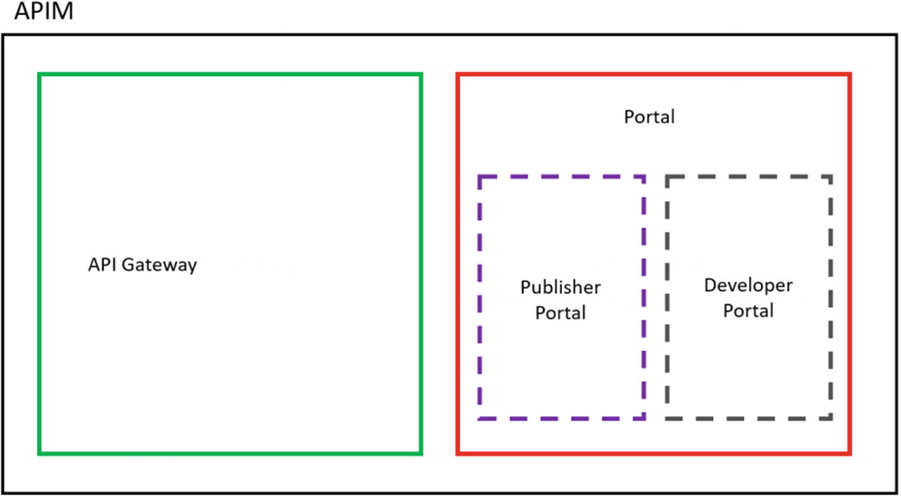
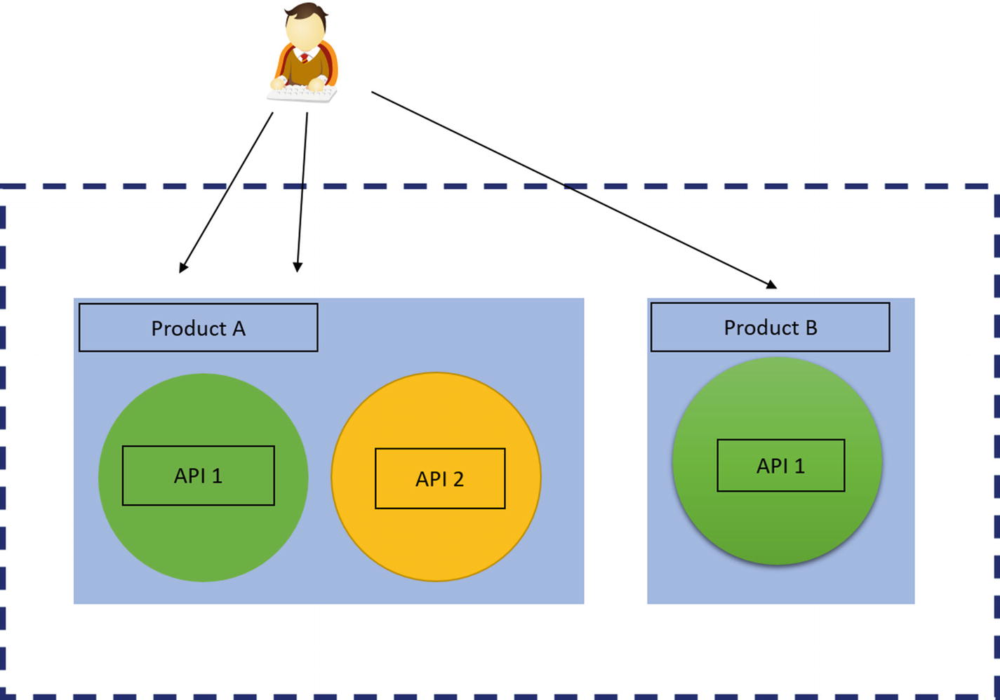

---


# Speaker

### Moses Mugisha

- Author of `mtn-momo` library
- Senior Software Engineer At Andela


---

### What is an API?

- Application Programming Interface
- interface that a software program presents to other programs, to humans & internet
- mostly intended to be understood and used by humans writing those other programs

---

### Examples Of APIS

- Momo API ;)
- GITHUB API
- Facebook graph API

---

### What makes a great API
- Usability
- Scalability 
- Performance
- Documentation and developer resources

---

### API Paradigms

- REST API
- RPC
- GraphQL
- Websockets
- Webhooks

---

### Which can be Divided into

 
- Request/Response APIs
- Event Driven APIs

---
### Request/Response APIS 

- APIs define a set of endpoints
- Clients make HTTP requests for data to those endpoints and the server returns responses
- The response is typically sent back as JSON or XML or binary.
          - Examples REST, GraphQL,RPC

---

### Event Driven APIS
- An API will send  a message to the configured URL when something happens
- Request/Response APIs can implement this through continuous polling of the server.

       - Examples Websockets, webhooks
 
---

### REST APIs
- Representational State Transfer (REST) 
- Its about resources
- A resource is an entity that can be identified, named,addressed, or handled on the web. 
- REST APIs expose data as resources and use standard HTTP methods to represent CRUD
Create, Read,Update, and Delete (CRUD) transactions against these resources

---

### General Guidelines for REST

- Resources are part of URLs, like /users .

- For each resource, two URLs are generally implemented: 

          - one   for the collection, like /users ,
          - and one for a specific element, like /users/U123 .
          
---          
### Rules Cont ....

- Nouns are used instead of verbs for resources. 

       For example, instead of /getUserInfo/U123  , use /users/U123 
       
 - HTTP methods like GET , POST , UPDATE , and DELETE inform the
    server about the action to be performed
    
    
---

### Rules cont ...

- Different HTTP methods invoked on the same URL provide different functionality

      POST -> for creating new resources
      GET -> for retriving a resource
      DELETE -> for deleting a resource
      PUT  -> for replacing a resource
      PATCH -> for partial update of a resource

---
## What MTN Mobile Money provides?

- sim card as a financial account
- sending and receiving money
- **withdraw and deposit through agents**
- payments (utilities, momo pay, online)
- network services (airtime, bundles)
- **remittances**

---


### with the Open API
 - Your software is a virtual agent

- withdraw from an account with the Collections API
- deposit with Disbursements API
- send money abroad with the Remittances API (NOT COVERED)
- ability to collect payments using MoMo Pay (NOT COVERED)

---

###  API Archtecture

- Leverages Azure API management
- To understand how the API works, we need to understand azure API management

### MOMO API Archtecture



---

## Archtecture Cont ...

API Gateway and the portal. 
The portal provides two different experiences, publisher and developer.

---

### API Gateway

 - API Gateway is the core engine
 - receives payment requests, processes them, connects to the backend service,
    and responding to requests.
    
  ---

### Products

- Products are the consumable packages in Azure API Management. 
- Products contain APIs, and one product can have multiple APIs.
- Also contain usage quota and the terms of use.

---

### Products


---

### Subscriptions
- Primary or secondar and are interchangable

- Subscription Keys are associated with a single prodduct 

- The subscription keys act as a first-level security feature, but more importantly, 
they are used to track developers, usage, and policy configurations.

- Developers can also register their applications using the developer portal
- A developer can have more than one subscription to each product. 
- Each subscription is identified by a subscription key, and each subscription key is scoped to a product.
 - A developer cannot use a single subscription key for two different products


---
### Developer Account

- Sign up on https://momodeveloper.mtn.com/

- Subscribe to Collections and Disbursement and obtain primary key for each

---


### Installation

You are required to have PHP 5.4.0 and later.

You can install the bindings via [Composer](http://getcomposer.org/). Run the following command:

```bash
composer require sparkplug/momoapi-php:dev-master
```

To use the bindings, use Composer's [autoload](https://getcomposer.org/doc/01-basic-usage.md#autoloading):

```php
require_once('vendor/autoload.php');
```
---
### Manual Installation

If you do not wish to use Composer, you can download the [latest release](https://github.com/sparkplug/momoapi-php/releases). Then, to use the bindings, include the `init.php` file.

```php
require_once('/path/to/momoapi-php/init.php');
```
---
### Sandbox credentials


 The library ships with a commandline application that helps 
 to create sandbox credentials. It assumes you have created an
 account on `https://momodeveloper.mtn.com` 
 and have your `Ocp-Apim-Subscription-Key`. 

```bash
## within the project, on the command line. In this example, our domain is akabbo.ug
$ ./vendor/sparkplug/momoapi-php/lib/Provision.php
$ providerCallBackHost: https://akabbo.ug
$ Ocp-Apim-Subscription-Key: f83xx8d8xx6749f19a26e2265aeadbcdeg
```
---

### Creds ...

- providerCallBackHost is your application's domain

- Ocp-Apim-Subscription-Key is your subscription key from momodeveloper account

- You will get a user secret and user id which we will use later

- We have to do this separately for collections and disbursement

---

## feedback

```bash
Here is your User Id and API secret : {'apiKey': 'b0431db58a9b41faa8f5860230xxxxxx', 'UserId': '053c6dea-dd68-xxxx-xxxx-c830dac9f401'}
```

---


### Configuration

- Best practice to configure as environment variables

* `BASE_URL`: An optional base url to the MTN Momo API. By default the staging base url will be used
* `ENVIRONMENT`: Optional enviroment, either "sandbox" or "production". Default is 'sandbox'
* `CURRENCY`: currency by default its EUR
* `CALLBACK_HOST`: The domain where you webhooks urls are hosted. This is mandatory.
* `COLLECTION_PRIMARY_KEY`: The collections API primary key,
* `COLLECTION_USER_ID`:  The collection User Id
* `COLLECTION_API_SECRET`:  The Collection API secret
* `REMITTANCE_USER_ID`:  The Remittance User ID
* `REMITTANCE_API_SECRET`: The Remittance API Secret
* `REMITTANCE_PRIMARY_KEY`: The Remittance Subscription Key
* `DISBURSEMENT_USER_ID`: The Disbursement User ID
* `DISBURSEMENT_API_SECRET`: The Disbursement API Secret
* `DISBURSEMENT_PRIMARY_KEY`: The Disbursement Primary Key

For maximum security, implement the integration with MTN in your backend

This way, you will not need any secret keys in your client


---

### conf cont ..

you can also use the MomoApi to globally set the different variables.


```php
MomoApi::setBaseUrl('base');

MomoApi::setTargetEnvironment("targetenv");

MomoApi::setCurrency("UGX");

MomoApi::setCollectionApiSecret("collection_api_secret");

MomoApi::setCollectionPrimaryKey("collection_primary_key");

MomoApi::setCollectionUserId("collection_user_id");

```

---


### Collections

Withdraw money from your customer's account

---

### Initializing collections

The collections client can be created with the following paramaters. Note that the `COLLECTION_USER_ID` and `COLLECTION_API_SECRET` for production are provided on the MTN OVA dashboard;

* `COLLECTION_PRIMARY_KEY`: Primary Key for the `Collection` product on the developer portal.
* `COLLECTION_USER_ID`: For sandbox, use the one generated with the `mtnmomo` command.
* `COLLECTION_API_SECRET`: For sandbox, use the one generated with the `mtnmomo` command.

You can create a collection client with the following:

```php
$client = Collection();
```

---


## Requesting a payment

- Call `requestToPay`, it returns a transaction id
- You can store the transaction id for later use


```php

        $coll = new Collection($currency = "c..", $baseUrl = "url..", $targetEnvironment = "u...", $collectionApiSecret = "u...", $collectionPrimaryKey = "u...", $collectionUserId = "u..."]);

        $params = ['mobile' => "256782181656", 'payee_note' => "34", 'payer_message' => "12", 'external_id' => "ref", 'currency' => "EUR", 'amount' => "500"];

        $t = $coll->requestToPay($params);

        $transaction = $coll->getTransaction($t);

```

---


### Requesting a payment

- In sandbox, use EUR as the currency ¯\\\_(ツ)\_/¯
- In production, use the currency of your country
- Use reference of your database transaction record as `externalId`
- `payerMessage` appears on your customer's statement
- `payeeNote` appears on your statement (as a virtual agent)

---


### But the payment is not yet complete

As an agent, you cannot exchange your goods until you are sure the payment has transferred to your account

So how can you be sure that the transaction has been completed?

---


### Polling

- Before exchanging goods, call `getTransaction` with the transaction id every few seconds until it succeeds or fails
- This technique is known as polling

---


### Callback

- if you do not want to poll, you can setup an API endpoint to receive requests from MTN when the transaction status changes,
- you can pass the endpoint url as part of `requestToPay`
- your endpoint should be called when the transaction fails or succeeds
- Note that callbacks do not currently work in the sandbox 

---


### Errors

- a transaction can fail immediately if;
  - credentials are incorrect/invalid/expired
  - the provided parameters are invalid (depending on the environment)
  - the phone number is not registered for mobile money
  - the customer has insufficient balance
- a transaction can fail eventually if;
  - the customer cancels the transaction
  - transaction times out

---


### Disbursements

Deposit money to a mobile money account

---


### Making a payment

- Call `transfer`, it returns  a transaction id or fails with  an error


```php

        $disbursement = new Disbursement();

        $params = ['mobile' => "256782181656", 'payee_note' => "34", 'payer_message' => "12", 'external_id' => "ref", 'currency' => "EUR", 'amount' => "500"];

        $t = $disbursement->requestToPay($params);


        $transaction = $disbursement->getTransaction($t);

```

---


### Making a payment

- Same as collections;
  - In sandbox, use EUR as the currency ¯\\\_(ツ)\_/¯
  - In production, use the currency of your country
  - Use a reference of your database record as `externalId`
- `payerMessage` appears on your statement
- `payeeNote` appears on the receiver's statement

---


## Making a payment

- Since there is no approval process for disbursements, it safe to assume they complete immediately
- For 100% certainty, you can poll using `disbursements.getTransaction` or use the callback
- Error handling is same as collections
